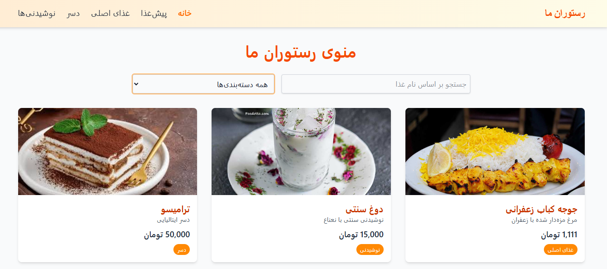
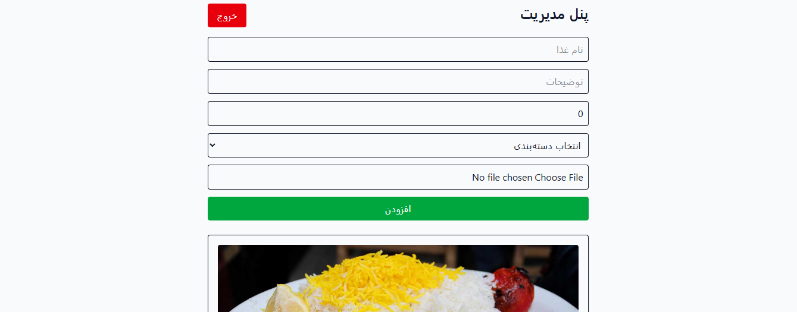
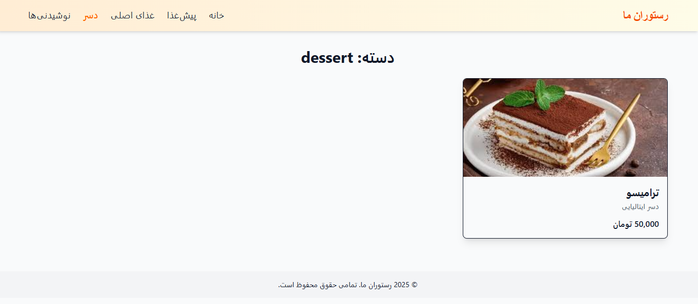

# 🍽️ منوی آنلاین رستوران (فارسی)

یک وب‌اپلیکیشن مدرن برای نمایش منوی رستوران به زبان فارسی، با قابلیت مدیریت کامل توسط ادمین، جستجو، فیلتر، و آپلود تصویر غذاها.

## 📸 تصاویر نمونه



---



---




---

## ✨ امکانات اصلی

- ✅ نمایش منو با تصاویر و قیمت
- ✅ فیلتر بر اساس دسته‌بندی و جستجو بر اساس نام
- ✅ فرم افزودن/ویرایش/حذف غذا
- ✅ آپلود تصویر واقعی با نمایش زنده
- ✅ ورود امن ادمین با کوکی JWT
- ✅ مخفی‌سازی خودکار پنل ادمین برای کاربران عادی
- ✅ طراحی واکنش‌گرا با Tailwind CSS

---

## 🛠️ تکنولوژی‌ها

| بخش       | ابزارها                                 |
|------------|------------------------------------------|
| رابط کاربری | React + Vite + TypeScript + Tailwind CSS |
| سرور       | Node.js + Express                        |
| دیتابیس    | PostgreSQL (مثلاً Supabase یا Railway)  |
| آپلود عکس | Multer + پوشه uploads                    |
| احراز هویت | JWT + HttpOnly Cookie                    |

---

## ⚙️ راه‌اندازی پروژه (لوکال)

### 1. کلون کردن پروژه

```bash
git clone https://github.com/your-username/restaurant-menu.git
cd restaurant-menu
```

### 2. راه‌اندازی سرور

```bash
cd server
npm install
```

سپس فایل `.env` ایجاد کنید:

```env
PORT=3000
JWT_SECRET=your_secret_key
DATABASE_URL=your_postgres_connection_string
```

### 3. ساخت جدول منو در PostgreSQL

```sql
CREATE TABLE menu (
  id SERIAL PRIMARY KEY,
  name TEXT NOT NULL,
  description TEXT,
  price INTEGER,
  category TEXT,
  image_url TEXT
);
```

### 4. اجرای سرور

```bash
node index.js
```

---

### 5. راه‌اندازی رابط کاربری

```bash
cd ../client
npm install
npm run dev
```

اکنون:
- کلاینت روی `http://localhost:5173`
- سرور روی `http://localhost:3000`

---

## 👤 اطلاعات ورود ادمین

| نام کاربری | رمز عبور |
|------------|-----------|
| `admin`    | `????`    |

---

## 📁 ساختار پروژه

```
restaurant-menu/
├── client/        # رابط کاربری React
├── server/        # سرور Node.js
│   ├── uploads/   # تصاویر آپلود شده
│   └── db.js      # اتصال به پایگاه‌داده
```

---

## 🧠 پیشنهادات توسعه در آینده

- افزودن سفارش آنلاین
- امتیازدهی کاربران به غذاها
- نسخه موبایلی به صورت PWA
- آپلود تصویر در Cloudinary یا CDN
- نقش‌های مختلف ادمین و کاربر

---


## 📘 English Summary

> This app is a Persian-language online restaurant menu built with modern full-stack tools.

### 🌟 Features
- Display menu items with real image uploads
- Search and category filters
- Admin login with secure JWT & HttpOnly cookies
- Admin panel for adding/editing/deleting items
- Responsive layout for mobile/desktop

### 🔧 Stack
- **Frontend:** React + Vite + Tailwind CSS
- **Backend:** Node.js + Express
- **Database:** PostgreSQL
- **Image Upload:** Multer to local `/uploads`
- **Auth:** JWT + Cookies

> Feel free to fork and adapt it for your own restaurant in any language 🌍


## ❤️ سپاس